# 🌍 CO₂ Dashboard — Performance Profiling & Optimization

This project visualizes CO₂ emissions data by countries and regions.
A special focus is placed on React performance optimization: search, sorting, year selection, and adding/removing columns.

# ⚙️ Tech Stack & Key Features

- React + Vite + TypeScript + Tailwind
- React Suspense for loading a large JSON (~100 MB)
- Web Worker for safe JSON parsing off the main thread
- Country table with search, sorting, year selector, and customizable columns
- Responsive design (horizontal scroll for tables)

# 📊 Scenarios & Metrics

Below is a template table to record your results before and after optimizations.
Parameters:

- Render Duration (RD) — render time of individual components.
- Interactions — what triggered renders.
- Flamegraph / Ranked — screenshots for visualization.

### 1) Sorting by Country Name / Population

| Parameter               |                   Before Optimization |                          After Optimization |
| ----------------------- | ------------------------------------: | ------------------------------------------: |
| **Interaction**         |               Sort by name/population |                     Sort by name/population |
| **RD (CountriesTable)** |                                 279ms |                                        10ms |
| **Interactions (why)**  |                 Every row re-rendered | Fewer redundant renders due to `React.memo` |
| **Flamegraph**          | 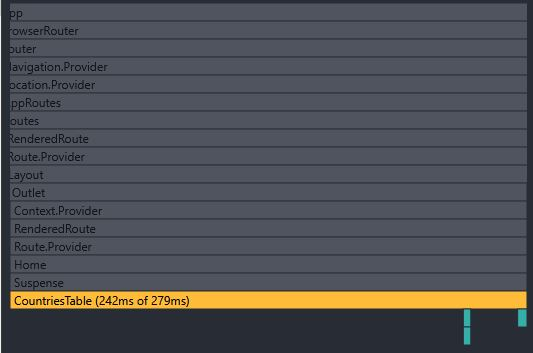 |         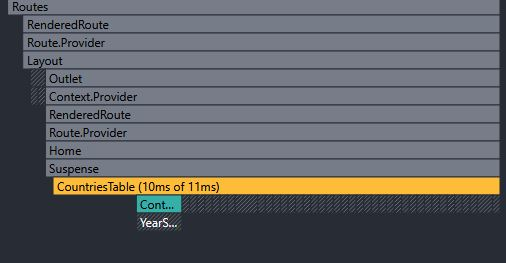 |
| **Commit info**         |  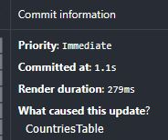 |          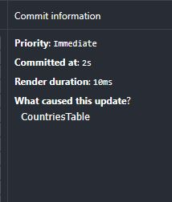 |

### 2) Searching Countries

| Parameter               |                     Before Optimization |                    After Optimization |
| ----------------------- | --------------------------------------: | ------------------------------------: |
| **Interaction**         |                  Typing in search input |                Typing in search input |
| **RD (CountriesTable)** |                                   256ms |                                   8ms |
| **Interactions (why)**  |         `setQuery` → filter → re-render |          Debounced & memoized results |
| **Flamegraph**          | 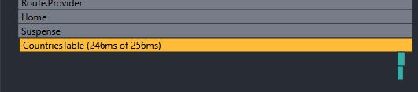 |  |
| **Commit info**         |  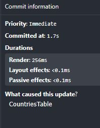 |  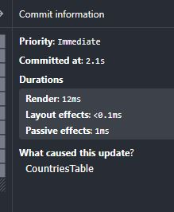 |

### 3) Year Selection

| Parameter               |                   Before Optimization |                    After Optimization |
| ----------------------- | ------------------------------------: | ------------------------------------: |
| **Interaction**         |          Selecting year from dropdown |                        Selecting year |
| **RD (CountriesTable)** |                                 294ms |                                   7ms |
| **Interactions (why)**  |        All rows updated with new year | Faster metric lookup with memoization |
| **Flamegraph**          | 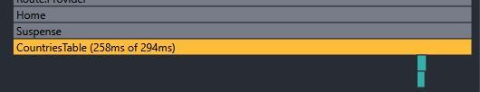 |   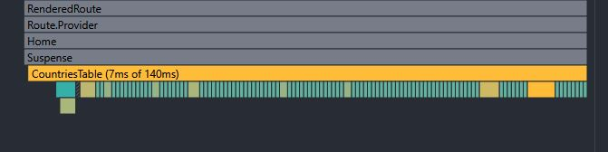 |
| **Commit info**         |  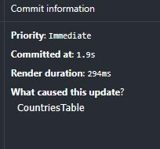 |    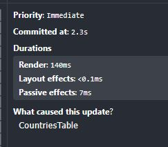 |

### 4) Adding / Removing Columns

| Parameter               |                      Before Optimization |                     After Optimization |
| ----------------------- | ---------------------------------------: | -------------------------------------: |
| **Interaction**         |                     Toggle extra columns |                   Toggle extra columns |
| **RD (CountriesTable)** |                                    290ms |                                    6ms |
| **Interactions (why)**  |          Table header + rows re-rendered |   Memoized header and selected columns |
| **Flamegraph**          | 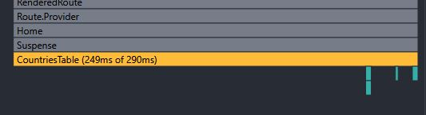 | 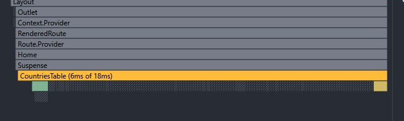 |
| **Commit info**         |  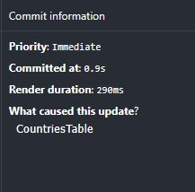 |  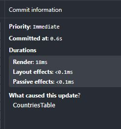 |

# ✅ Applied Optimizations

- useMemo
  - Memoized rows (filtered, searched, sorted list)
  - Memoized years and availableFields
  - Memoized selectedColumns
- React.memo
  - ControlsBar, TableHeader, CountryRow wrapped with React.memo
  - Custom comparison to avoid unnecessary renders
- useCallback
  - Stabilized event handlers: year change, query change, sort change, open/close column modal

# 📈 Results Summary

| Scenario    | RD Before → After | Notes                     |
| ----------- | ----------------: | ------------------------- |
| Sorting     |      279ms → 10ms | Rows memoized             |
| Search      |       256ms → 8ms | Debounce + memoized rows  |
| Year Select |       294ms → 7ms | Optimized metric lookup   |
| Columns     |       290ms → 6ms | Memoized header & columns |
